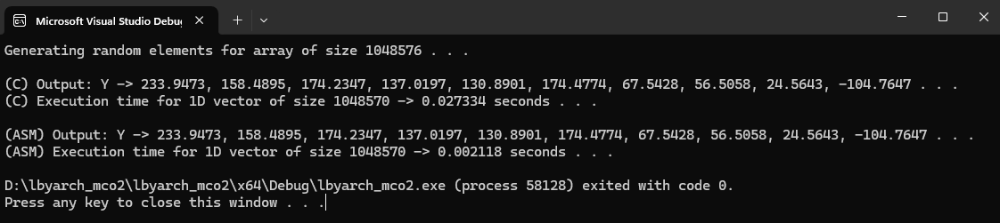
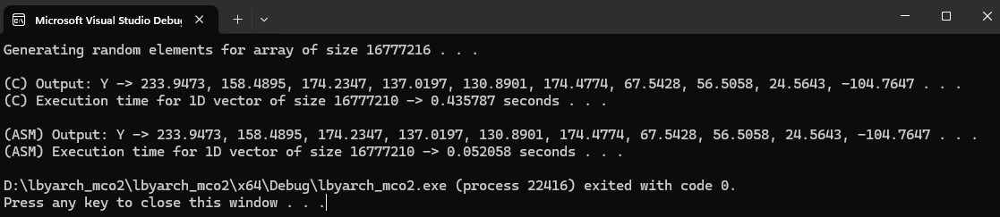
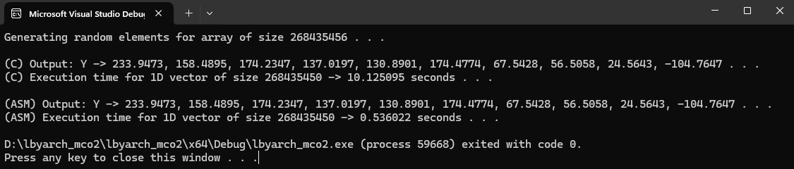
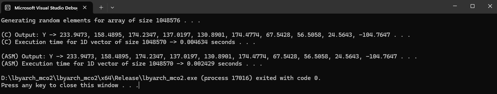
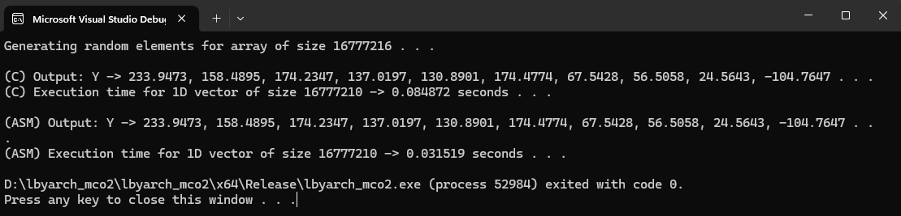
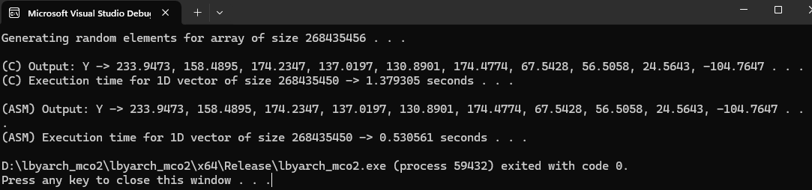

# 1D Stencil Operation in C and x86-64 Assembly
By:
- Sulit, Anne Gabrielle
- Torio, Ysobella

The 1D Stencil Operation is illusrated as:
 
`Y[i] = X[i] + X[i+1] + X[i+2] + X[i+3] + X[i+4] + X[i+5] + X[i+6]`
 In this formula:

- `X` is the input array containing the initial data.
- `Y` is the output array where the result of the stencil operation will be stored.
- `i` is the index of the current element in the arrays `X` and `Y`.

This stencil operation was implemented in both C and x86-64 assembly kernels.

## Average Execution Time (in seconds)
<table>
    <thead>
        <tr>
            <td>n (Size of X)</td>
            <td colspan=2 style="text-align: center;">2^20 (1,048,576)</td>
            <td colspan=2 style="text-align: center;">2^24 (16,777,216)</td>
            <td colspan=2 style="text-align: center;">2^28 (268,435,456)</td>
        </tr>
    </thead>
    <tbody>
        <tr>
            <td>Kernel</td>
            <td style="text-align: center;">C</td>
            <td style="text-align: center;">ASM</td>
            <td style="text-align: center;">C</td>
            <td style="text-align: center;">ASM</td>
            <td style="text-align: center;">C</td>
            <td style="text-align: center;">ASM</td>
        </tr>
        <tr>
            <td>Debug Mode</td>
            <td>0.025014</td>
            <td>0.002095</td>
            <td>0.380216</td>
            <td>0.032941</td>
            <td>5.729582</td>
            <td>0.516240</td>
        </tr>
        <tr>
            <td>Release Mode</td>
            <td>0.007989</td>
            <td>0.002597</td>
            <td>0.092709</td>
            <td>0.036021</td>
            <td>1.440770</td>
            <td>0.568849</td>
        </tr>
    </tbody>
</table>

### Analysis of Results

The performance analysis of the kernels in both Debug and Release modes reveals interesting insights into the behavior of C and ASM kernels under different compilation settings. The data provided shows that the C kernel performs significantly slower in Debug mode compared to Release mode, regardless of the size of the data being processed. This is consistent with the general understanding that Debug mode includes additional checks and optimizations are turned off, leading to slower execution times.

On the other hand, the ASM kernel exhibits a slight performance decrease in Release mode, which is somewhat counterintuitive. Typically, Release mode is expected to offer better performance due to optimizations that are not present in Debug mode. However, the observed behavior suggests that the ASM kernel might not benefit as much from these optimizations, possibly due to its inherent complexity or the specific optimizations applied by the compiler.

The performance discrepancy between Debug and Release modes for both kernels can be attributed to the fundamental differences in how these modes handle code optimization and runtime checks. Debug mode is designed for development and debugging, with a focus on ease of use and diagnostics, at the expense of performance. In contrast, Release mode prioritizes performance, enabling optimizations that can significantly reduce execution time but may introduce complexity in debugging.

It is also worth noting that the performance of kernels can be influenced by various factors, including the specific compiler and optimization settings used. For instance, the use of certain compiler flags or the inclusion of specific optimizations can affect the performance of both C and ASM kernels in both Debug and Release modes.

## Program Output with Correctness Check (C & x86-64)
### Debug Mode

### Release Mode

